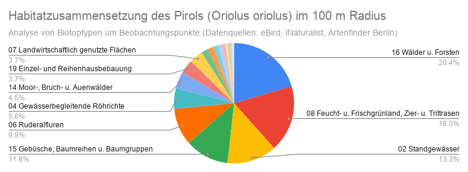
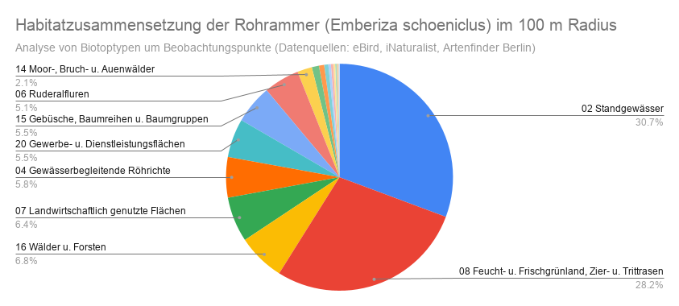
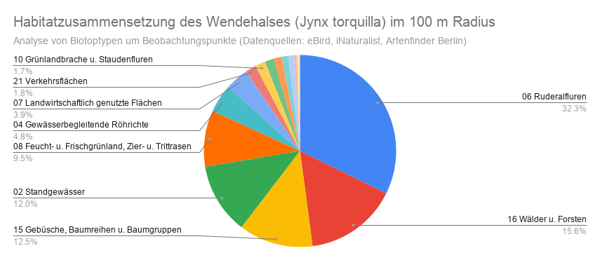
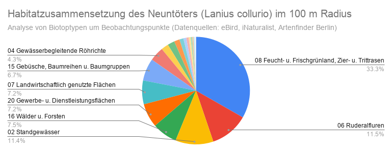

# Vogelhabitate in Berlin – GIS Analyse

Analyse von Biotoptypen im Umfeld ausgewählter Vogelarten basierend auf Beobachtungsdaten aus mehreren Quellen und räumlicher Auswertung in QGIS.

## Methodik

Für die Analyse wurden Vogelbeobachtungsdaten von 2024 und 2025 in Berlin aus drei verschiedenen Quellen verwendet:
- eBird
- iNaturalist
- Artenfinder Berlin

Untersuchte Arten:
- Pirol (Oriolus oriolus)
- Rohrammer (Emberiza schoeniclus)
- Wendehals (Jynx torquilla)
- Neuntöter (Lanius collurio)

### Arbeitsschritte

1. Zusammenführung der Beobachtungsdaten aus verschiedenen Quellen mit PostgreSQL (siehe Vogelbeobachtungen_Berlin)

2. Import der Beobachtungsdaten in QGIS

3. Erstellung von Pufferzonen um die Beobachtungspunkte:
   - 100 Meter Radius
   - 200 Meter Radius

4. Räumliche Verschneidung (Intersection) der Puffer mit der Biotoptypenkarte des Berliner Umweltatlas

5. Berechnung der Flächenanteile der Biotoptypen innerhalb der Puffer

6. Export der Ergebnisse als CSV

7. Weiterverarbeitung in Google Sheets:
   - Berechnung prozentualer Anteile
   - Visualisierung als Tortendiagramme

   

## Ergebnisse

Für die Analyse wurden sowohl 100 m als auch 200 m Pufferzonen untersucht.

Die Auswertung der 200 m Puffer zeigte, dass die Ergebnisse aufgrund der hohen kleinräumigen Heterogenität der Berliner Stadtlandschaft nur eingeschränkt aussagekräftig sind. Durch die größere Pufferzone werden viele unterschiedliche und teils nicht artspezifische Biotoptypen einbezogen, wodurch die habitatbezogenen Signale verwässert werden.

Aus diesem Grund wird im Folgenden der Fokus auf die 100 m Pufferzone gelegt, da diese eine präzisere Abbildung der unmittelbaren Habitatumgebung der Beobachtungspunkte ermöglicht.

### 100 m Radius

#### Pirol

#### Rohrammer

#### Wendehals

#### Neuntöter

## Interpretation der Ergebnisse

Auch der 100 m Radius ist insbesondere für die Rohrammer (*Emberiza schoeniclus*) vermutlich noch zu groß gewählt. Aufgrund ihrer engen Bindung an gewässernahe Röhrichtstrukturen wäre ein kleinerer Radius von etwa 25–50 m fachlich sinnvoller, um das tatsächlich genutzte Habitat präziser abzubilden.

Zudem sind sehr kleine prozentuale Anteile einzelner Biotoptypen nur eingeschränkt interpretierbar. In einer stark fragmentierten Stadtlandschaft wie Berlin können solche geringen Anteile zufällig durch kleinflächige Biotopvorkommen innerhalb des Puffers entstehen und müssen nicht zwingend eine ökologische Relevanz für die jeweilige Art widerspiegeln.

Für die Interpretation sollten daher primär die dominierenden Biotoptypen berücksichtigt werden, während sehr kleine Flächenanteile als potenziell zufallsbedingt eingeordnet werden sollten.